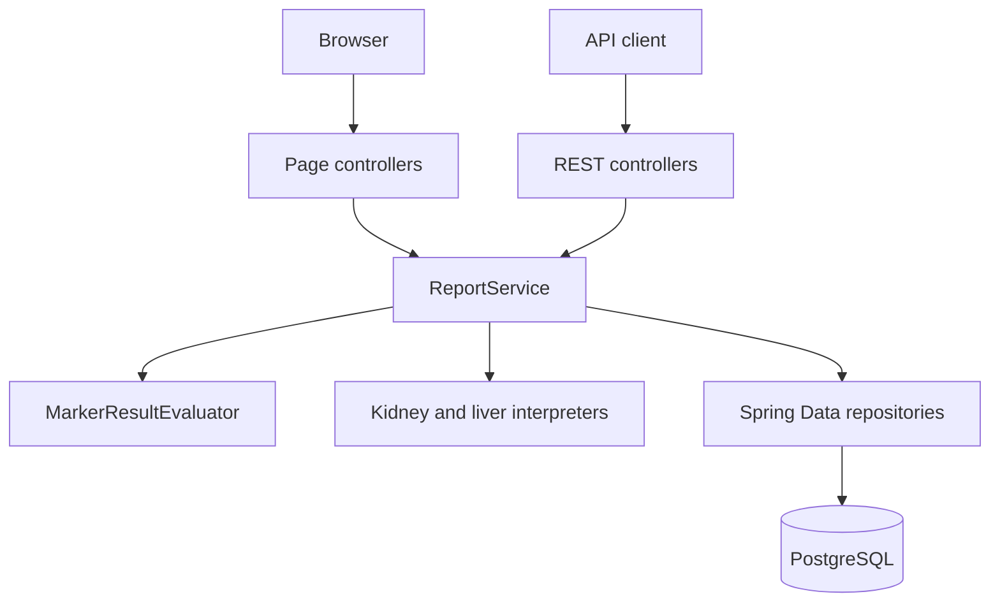
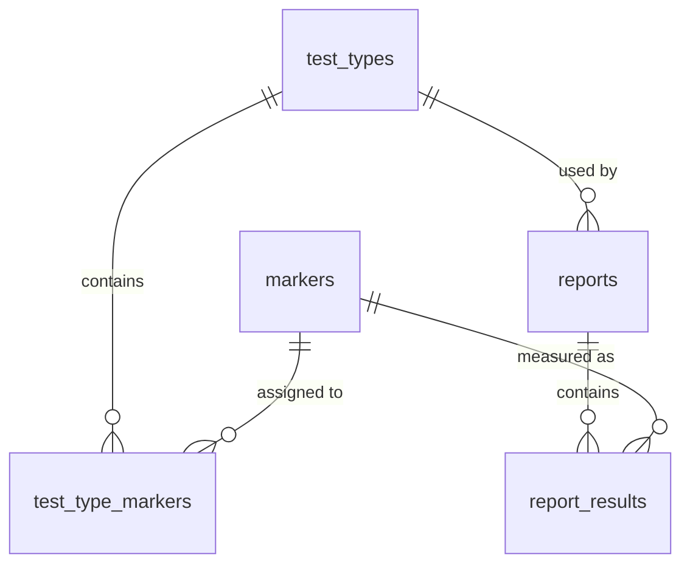

# Blood Work Report — Laboratory Report Generation System

A full-stack laboratory report application built with Java 21 and Spring Boot. Users choose a test panel, enter numeric or qualitative marker values, and receive a saved report containing evaluated marker statuses and a rule-based interpretation.

The project currently supports **Kidney Function Test** and **Liver Function Test** panels. It provides both a server-rendered Thymeleaf interface and a REST API, backed by the same service layer.

---

## What it does

**For users**

- Choose a laboratory test panel from the home page.
- Render the markers belonging to the selected panel without leaving the page.
- Enter numeric, qualitative, or mixed marker values.
- Compare numeric results with configured minimum and maximum reference values.
- View each marker as `LOW`, `NORMAL`, `HIGH`, or `ABNORMAL`.
- Read possible influences for markers outside their configured reference.
- Generate, view, edit, and delete saved reports.

**Interpretation panels**

- **Kidney Function Test** — eGFR filtration categories, creatinine and urea findings, urine protein/blood findings, infection-related urine patterns, electrolytes, minerals, glucose, and ketones.
- **Liver Function Test** — ALT/AST injury patterns, ALP/GGT cholestatic patterns, bilirubin, albumin, INR, cholinesterase, R-value classification, enzyme elevation severity, and possible influences.

The interpretation is a transparent rule-based explanation of the submitted values. It is not a medical diagnosis and should not replace a qualified healthcare professional or the reference range used by the laboratory that performed the test.

---

## Tech stack

| Area | Technology |
|------|------------|
| Language | Java 21 |
| Framework | Spring Boot 4.1.0 — Web MVC, Data JPA, Thymeleaf |
| Database | PostgreSQL + Hibernate |
| API format | JSON REST endpoints |
| Web interface | Thymeleaf server-side rendering |
| Testing | JUnit 5, Spring Boot test |
| Build | Maven with the Maven Wrapper |
| Utilities | Lombok, BigDecimal for laboratory values |

---

## Architecture

The application uses a layered MVC architecture. Web requests are handled by controllers, business rules are coordinated by services, persistence is handled through Spring Data repositories, and Thymeleaf renders the browser pages.



### The marker journey

1. The browser form or REST client submits a test type and marker values.
2. The controller converts the input into a DTO such as `MarkerResultRequest`.
3. `ReportService` verifies that every submitted marker belongs to the selected test type and that all required markers were submitted exactly once.
4. `MarkerResultEvaluator` checks each value against the marker configuration and assigns a status.
5. `ReportService` calls the matching interpretation class for the selected panel.
6. The report and its `MarkerResult` records are saved in one transactional operation.
7. The web controller renders the report, while the REST controller maps it to `ReportResponse`.

Create and edit use the same validation, evaluation, and interpretation flow. Creation builds a new report; editing updates the existing report and recalculates its statuses and interpretation before saving it again.

---

## Domain model



The database separates reusable marker definitions from submitted report results:

- `test_types` stores panels such as Kidney Function Test and Liver Function Test.
- `markers` stores the name, unit, reference limits, value type, description, and possible influences.
- `test_type_markers` connects panels with their required markers.
- `reports` stores the selected panel, generated report code, date, and final interpretation.
- `report_results` stores one evaluated value per marker and its status.

The full database definition and development seed data are in [`schema.sql`](project-module/src/main/resources/schema.sql).

---

## Design decisions worth explaining

### One service coordinates the complete report workflow

`ReportService` is the application’s orchestration point. It validates the request, creates or loads the report, applies marker results, delegates status evaluation, selects the appropriate interpreter, and saves the final entity inside a transaction.

This keeps controllers focused on HTTP and form handling. The REST API and the Thymeleaf pages therefore use the same business rules instead of maintaining two separate implementations.

### Numeric, qualitative, and mixed values are explicit

Markers have a `MarkerValueType`:

- `NUMERIC` accepts values such as `1.2` or `95`.
- `QUALITATIVE` accepts values such as `NEGATIVE`, `POSITIVE`, or `TRACE`.
- `MIXED` supports either representation, which is useful for urine markers that may be reported as a number or as a qualitative result.

The service rejects requests that provide both representations or neither representation. The database also enforces that exactly one result column is populated.

### Reference-range evaluation is centralized

`MarkerResultEvaluator` contains the common comparison rules. It supports two-sided ranges, minimum-only markers such as eGFR, maximum-only markers such as creatinine, qualitative comparisons, and marker-specific rules such as HbA1c.

`BigDecimal.compareTo()` is used for laboratory values so numeric comparison is not affected by differences in decimal scale.

### Interpretation is separated by test panel

Kidney and liver rules are implemented in separate interpreter classes rather than being placed in the controller or mixed into the generic evaluator. This keeps simple marker status evaluation separate from multi-marker clinical patterns and makes each panel’s algorithm easier to extend.

`ReportService` selects the interpreter for the test type and stores the generated text with the report, so the displayed report remains a snapshot of the interpretation produced for that submission.

### DTOs protect the application boundary

`MarkerResultRequest`, `CreateReportRequest`, and `UpdateReportRequest` describe input from an API client. `ReportResponse` and `MarkerResultResponse` describe output. This prevents the REST API from depending directly on the internal JPA entity structure and avoids serializing back-references such as `Marker.testTypes` or `MarkerResult.report`.

### Report results are owned by their report

`Report` has a cascading, orphan-removing `@OneToMany` relationship to `MarkerResult`. A report update can therefore reuse its existing result rows, and deleting a report also removes its child results.

---

## Running it locally

### Prerequisites

- Java 21
- PostgreSQL running locally
- A PostgreSQL database user with permission to create and drop tables

### 1. Clone the repository

```bash
git clone https://github.com/Aminalsh/blood-work-report.git
cd blood-work-report/project-module
```

### 2. Create a development database

```bash
createdb blood_work_report
```

If `createdb` is not available, create a database named `blood_work_report` through pgAdmin or `psql`.

### 3. Configure PostgreSQL

Create `project-module/src/main/resources/application.properties`:

```properties
spring.datasource.url=jdbc:postgresql://localhost:5432/blood_work_report
spring.datasource.username=postgres
spring.datasource.password=your_postgres_password

spring.jpa.hibernate.ddl-auto=none
spring.sql.init.mode=always
```

`application.properties` is ignored by Git so that local database credentials are not committed.

> **Development warning:** `schema.sql` starts by dropping the report tables before recreating and seeding them. This is convenient for a clean local database, but it deletes existing development data whenever the schema script runs. Do not use this initialization script against a production database.

### 4. Start the application

From `project-module/`:

```bash
bash mvnw spring-boot:run
```

On Windows:

```powershell
.\mvnw.cmd spring-boot:run
```

Open <http://localhost:8080> in a browser.

The schema seeds the two currently supported test panels and their markers. Select a panel, enter every required marker value, and choose **Create report**.

### 5. Run the tests

```bash
bash mvnw test
```

The current test suite includes a Spring application-context smoke test. The interpreters and service workflows are good candidates for additional unit and integration tests as the project grows.

---

## API reference

### Test types and markers

| Method | Path | Description |
|--------|------|-------------|
| `GET` | `/test-types` | Return all configured test panels |
| `GET` | `/test-types/{testTypeId}/markers` | Return the markers assigned to a panel |

### Reports

| Method | Path | Description |
|--------|------|-------------|
| `POST` | `/api/reports` | Create and evaluate a report |
| `GET` | `/api/reports` | Return all reports, newest first |
| `GET` | `/api/reports/{reportId}` | Return one report with marker results and interpretation |
| `PUT` | `/api/reports/{reportId}` | Re-evaluate and update an existing report |
| `DELETE` | `/api/reports/{reportId}` | Delete a report and its results |

Every report request must contain exactly one result for every marker assigned to the selected test type. A result contains either a numeric value or a qualitative value:

```json
{
  "testTypeId": 1,
  "results": [
    {
      "markerId": 1,
      "numericValue": 1.1,
      "qualitativeValue": null
    },
    {
      "markerId": 11,
      "numericValue": null,
      "qualitativeValue": "NEGATIVE"
    }
  ]
}
```

The example shows the request shape only. The actual marker IDs depend on the records created in the local database, and a real request must include the complete marker set for the chosen panel.

### Browser pages

`/` · `/reports` · `/reports/{reportId}` · `/reports/{reportId}/edit`

---

## Project structure

```text
project-module/src/main/java/io/everyonecodes/spring_module/
├── controller/                 HTTP and Thymeleaf controllers
├── dto/                        API and form request/response objects
├── global_exception_handling/  REST error responses and not-found errors
├── interpretations/            Kidney and liver interpretation algorithms
├── model/                      JPA entities and enums
├── repository/                 Spring Data JPA repositories
└── service/                    Report orchestration and marker evaluation
```

The browser templates are under [`src/main/resources/templates`](project-module/src/main/resources/templates), and the stylesheet is under [`src/main/resources/static/css/style.css`](project-module/src/main/resources/static/css/style.css).

---

## Known gaps and next steps

- Reference ranges are seeded configuration values. They can differ between laboratories and may depend on age, sex, pregnancy, method, and other patient-specific factors.
- There is currently no authentication, patient account, or access-control layer.
- The current automated test coverage is limited; the interpretation algorithms should gain focused tests for normal, borderline, and multi-marker patterns.
- Reports are stored and displayed as HTML, but there is no PDF export or email delivery yet.
- Adding a new test panel currently requires connecting a new interpreter in `ReportService`; an interpreter registry could make this more extensible.
- `schema.sql` is designed for development initialization and should be replaced with a migration tool such as Flyway or Liquibase for production use.

---

## Author

**Amin Alsh** — Java backend developer

- [GitHub repository](https://github.com/Aminalsh/blood-work-report)
